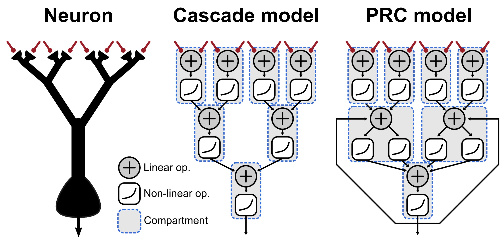

# Linear-nonlinear dendrites

<div align="center">
=3.8"/>

<a href="https://doi.org/10.1101/2021.03.25.437091">

</a>
</div>

Neurons are very complicated computational devices, incorporating numerous
non-linear processes, particularly in their dendrites. A simple way to capture
the complexities of real neuron computation is with models based on a cascade of
linear-nonlinear operations.

The scripts in this repo demonstrate how models based on parallel and looped
linear-nonlinear operations, which we call parallel and recurrent cascade (PRC)
models, can capture important features of real neurons.



For more information, see
[our paper](https://doi.org/10.1101/2021.03.25.437091):

> Harkin&ast;, Shen&ast;, Goel, Richards&ast;&ast;, and Naud&ast;&ast;. Parallel
> and recurrent cascade models as a unifying force for understanding
> sub-cellular computation. bioRxiv, 2021. doi: 10.1101/2021.03.25.437091.
>
> &ast; These authors contributed equally.
>
> &ast;&ast; These authors also contributed equally.

## Contents

- `demos`: Demonstrations of various aspects of PRC neuron models corresponding
  to figures 3-6 of Harkin, Shen, *et al*. (2021).
- `training`: Scripts that illustrate training of multi-layered neural networks
  containing PRC models using backprop. Corresponds to figures 7 and 8 of
  Harkin, Shen, *et al*. (2021).

## Installation

To download the code and all dependencies, paste the following
into a terminal. Make sure you have Anaconda installed, since it
is required to manage dependencies. This set of commands will
create a new Anaconda environment called "teaching" for this
project.

```sh
git clone --recurse-submodules \
    https://github.com/nauralcodinglab/linear-nonlinear-dendrites.git \
    && cd linear-nonlinear-dendrites \
    && conda env create -f environment.yml \
    && conda activate lnldendrites \
    && pip install -e ./ez-ephys
```

If installation of the conda environment fails, try creating an empty conda
environment and installing the minimal requirements from `requirements.txt`
instead.

```sh
# Run from inside linear-nonlinear-dendrites repo
conda create -n lnldendrites python=3.8 \
    && conda activate lnldendrites \
    && pip install -r requirements.txt \
    && pip install -e ./ez-ephys
```


## Requirements

This project requires Python version 3.5 or newer because of type hints. Minimal
dependencies are listed in `requirements.txt`.

Most scripts have been tested on MacOS v10.15 and Manjaro Linux v20 and v21
using Python 3.8 or newer. Scripts for training networks of PRC neurons have
been tested on CentOS.


## Contributors

Code was written by Emerson Harkin, Peter Shen, Richard Naud, and Anish Goel.
Parts of the code used for training networks of PRC neurons (under `training`)
are modified or reproduced from Friedeman Zenke's
[SpyTorch](https://doi.org/10.5281/zenodo.3724018).


## License

If you use this code in a publication, please cite our paper!

```
@article{harkin_parallel_2021,
	title = {
        Parallel and recurrent cascade models as a unifying force for
        understanding sub-cellular computation
    },
	doi = {10.1101/2021.03.25.437091},
	journaltitle = {{bioRxiv}},
	author = {
        Harkin, Emerson F and Shen, Peter R and Goel, Anish
        and Richards, Blake A and Naud, Richard
    },
	date = {2021},
	langid = {english},
}
```

<p align="center">
<a rel="license" href="http://creativecommons.org/licenses/by/4.0/"></a>
<br />
This work is licensed under a <a rel="license" href="http://creativecommons.org/licenses/by/4.0/">Creative Commons Attribution 4.0 International License</a>.
</p>

This software is provided "as-is" in the spirit of the
[CRAPL](https://matt.might.net/articles/crapl/CRAPL-LICENSE.txt)
academic-strength open-source license.
